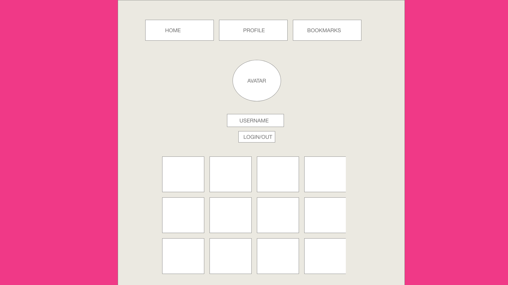

# Wireframe 

# A proper Readme.md file 

# Navigation Bar
* Home (Photo-Grid)
* User Profile (Maximum of 3 ppl.)
* Bookmarks (Saved Images)

# User is logged in or user is logged out

# Hint
* This is hard-coded user information inside of state
    * User Profile
    * Profile Image
    * Username
    * Grid Photos
* Use a Javascript, CSS, frontend library  (SASS/Bootstrap/etc.) - only one library. Not one of each.# photo-app
